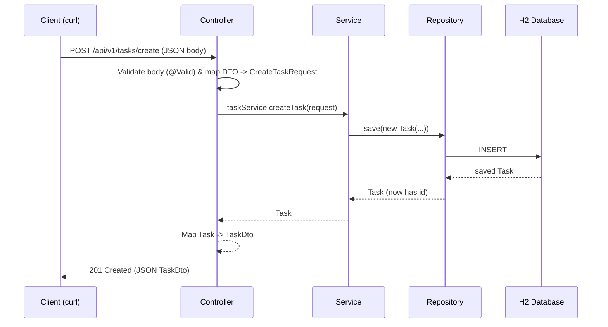

# Todo App

A simple REST API for managing tasks, built with Spring Boot. This project is a
learning exercise for Spring/Spring Boot — it follows a classic layered
architecture (Controller → Service → Mapper → Repository) so you can see how a
real Spring application is organized.

## Tech Stack

| Tool | Version | Why it's used |
|---|---|---|
| [Java](https://www.oracle.com/java/) | 25 | Main language |
| [Spring Boot](https://spring.io/projects/spring-boot) | 4.1.1 | Application framework, auto-configuration |
| [Maven](https://maven.apache.org/) | — (wrapper `./mvnw`) | Build & dependency management |
| Spring Web (MVC) | — | Exposes the REST endpoints (`@RestController`) |
| Spring Data JPA | — | Talks to the database (`JpaRepository`) |
| [H2](https://www.h2database.com/) | — | In-memory database (data is wiped on restart) |
| Bean Validation | — | Validates request bodies (`@NotBlank`, `@NotNull`, ...) |

## Project Structure

```text
src/main/java/com/learning/todoapp/
├── TodoappApplication.java      # Entry point — runs the Spring Boot app
├── controller/
│   ├── TaskController.java      # Receives HTTP requests, returns HTTP responses
│   └── GlobalExceptionHandler.java  # Turns exceptions into clean JSON error responses
├── domain/
│   ├── CreateTaskRequest.java   # Service-layer "in" model (create)
│   ├── UpdateTaskRequest.java   # Service-layer "in" model (update)
│   ├── dto/                     # Request/response shapes for the API (JSON)
│   │   ├── CreateTaskRequestDto.java
│   │   ├── UpdateTaskRequestDto.java
│   │   ├── TaskDto.java
│   │   └── ErrorDto.java
│   ├── entity/                  # JPA entities = database tables
│   │   ├── Task.java
│   │   ├── TaskPriority.java    # enum: LOW / MEDIUM / HIGH
│   │   └── TaskStatus.java      # enum: OPEN / COMPLETE
│   └── repository/
│       └── TaskRepository.java  # Spring Data JPA repository (saves/queries tasks)
├── mapper/
│   ├── TaskMapper.java          # Converts DTO ↔ service model ↔ entity
│   └── impl/TaskMapperImpl.java
├── service/
│   ├── TaskService.java         # Business logic interface
│   └── impl/TaskServiceImpl.java
└── exception/
    └── TaskNotFoundException.java
```

### How a request flows through the layers



Each layer has one job:

- **Controller** — only cares about HTTP: accept requests, hand off to the service,
  and return a response with the right status code.
- **Service** — business logic (default status `OPEN`, timestamps, "not found" when
  the id doesn't exist).
- **Mapper** — converts between DTOs (what clients see) and entities (what the DB stores).
- **Repository** — saves and loads entities; Spring Data JPA writes the SQL for you.

## How to Run

Requirements: **JDK 25** and **Maven** (or use the bundled Maven wrapper).

```bash
# start the app (port 8080)
./mvnw spring-boot:run
```

The API is then available at: `http://localhost:8080/api/v1/tasks`

> **H2 is in-memory.** Every time you restart the app the database is created
> empty again. There is no migration/seed data on purpose — write a quick `POST`
> to add rows.

### H2 Database Console

The H2 web console lets you inspect the running database:

- URL: `http://localhost:8080/h2-console`
- JDBC URL: `jdbc:h2:mem:testdb`
- Username: `sa`
- Password: *(leave blank)*

## API Reference

Base URL: `http://localhost:8080`

| Method | Path | Description | Success status |
|---|---|---|---|
| POST | `/api/v1/tasks/create` | Create a task | `201 Created` |
| GET | `/api/v1/tasks/` | List all tasks (sorted by creation time) | `200 OK` |
| PUT | `/api/v1/tasks/{taskId}` | Update a task | `200 OK` |
| DELETE | `/api/v1/tasks/{taskId}` | Delete a task | `204 No Content` |

There is **no authentication** — every call is anonymous.

### Create a task — `POST /api/v1/tasks/create`

Request body (`application/json`):

| Field | Required | Type / values | Notes |
|---|---|---|---|
| `title` | ✅ | string | 1–255 chars |
| `priority` | ✅ | `LOW` / `MEDIUM` / `HIGH` | |
| `description` | ❌ | string | Max 1000 chars |
| `dueDate` | ❌ | date `YYYY-MM-DD` | Today or a future date |

```json
{
  "title": "Buy groceries",
  "description": "Milk, eggs, bread",
  "dueDate": "2026-12-31",
  "priority": "HIGH"
}
```

Response `201 Created` — a new task starts out with status `OPEN` and a
generated UUID `id`:

```json
{
  "id": "55a8d547-251b-4d4c-84d7-8c3911cbd505",
  "title": "Buy groceries",
  "description": "Milk, eggs, bread",
  "dueDate": "2026-12-31",
  "priority": "HIGH",
  "status": "OPEN"
}
```

### List tasks — `GET /api/v1/tasks/`

```console
$ curl http://localhost:8080/api/v1/tasks/
```

Response `200 OK` — JSON array of `TaskDto` objects:

```json
[
  {
    "id": "55a8d547-251b-4d4c-84d7-8c3911cbd505",
    "title": "Buy groceries",
    "description": "Milk, eggs, bread",
    "dueDate": "2026-12-31",
    "priority": "HIGH",
    "status": "OPEN"
  }
]
```

### Update a task — `PUT /api/v1/tasks/{taskId}`

Request body — **note the status field is called `taskStatus`, not `status`**:

| Field | Required | Type / values | Notes |
|---|---|---|---|
| `title` | ✅ | string | 1–255 chars |
| `taskStatus` | ✅ | `OPEN` / `COMPLETE` | |
| `priority` | ✅ | `LOW` / `MEDIUM` / `HIGH` | |
| `description` | ❌ | string | Max 1000 chars |
| `dueDate` | ❌ | date `YYYY-MM-DD` | Today or a future date |

```json
{
  "title": "Buy groceries x2",
  "description": "Bread",
  "dueDate": "2026-12-31",
  "taskStatus": "COMPLETE",
  "priority": "LOW"
}
```

Response `200 OK` — the updated `TaskDto`.

If the id doesn't exist, you get `404 Not Found`:

```json
{
  "error": "Task with ID '00000000-0000-0000-0000-000000000000' not found"
}
```

### Delete a task — `DELETE /api/v1/tasks/{taskId}`

Response `204 No Content`. Note: deleting a non-existent id currently returns
`204` silently (the service uses `deleteById` without checking existence first).

## Sample `curl` Commands

```bash
# Create a task -> 201
curl -i -X POST http://localhost:8080/api/v1/tasks/create \
  -H "Content-Type: application/json" \
  -d '{"title":"Buy groceries","description":"Milk, eggs, bread","dueDate":"2026-12-31","priority":"HIGH"}'

# List tasks -> 200
curl -i http://localhost:8080/api/v1/tasks/

# Update a task -> 200
curl -i -X PUT http://localhost:8080/api/v1/tasks/55a8d547-251b-4d4c-84d7-8c3911cbd505 \
  -H "Content-Type: application/json" \
  -d '{"title":"Done now","taskStatus":"COMPLETE","priority":"HIGH"}'

# Delete a task -> 204
curl -i -X DELETE http://localhost:8080/api/v1/tasks/55a8d547-251b-4d4c-84d7-8c3911cbd505

# Validation error (missing priority) -> 400
curl -i -X POST http://localhost:8080/api/v1/tasks/create \
  -H "Content-Type: application/json" \
  -d '{"title":"No priority"}'
```

## Error Handling

Validation failures return `400 Bad Request`; the body picks the *first*
validation message, wrapped in an `ErrorDto`:

```json
{
  "error": "Task priority must be provided"
}
```

Common messages:

| Message | Trigger |
|---|---|
| `Title must be <= 255 chars and >= 1 chars` | missing/empty/too-long `title` |
| `Description must be <= 1000 chars` | `description` longer than 1000 chars |
| `Due day must be present or future` | `dueDate` in the past |
| `Task priority must be provided` | missing `priority` |
| `Task status must be provided` | missing `taskStatus` on update |
| `Task with ID '<id>' not found` | PUT on a non-existent id (`404`) |

## Learning Notes

- **Lombok is not used** — DTOs are Java `record`s, and the entity uses plain
  getters/setters so you can see the "manual" way first.
- **Validation lives on the DTOs**, not the entity. The controller triggers it
  with `@Valid`; the `GlobalExceptionHandler` converts the failure into JSON.
- **The mapper exists** so the controller never touches `Task` entities directly.
- Want to try next? A few good exercises:
  - GET a single task by id (`@GetMapping("/{taskId}")`)
  - Make `DELETE` return `404` when the id doesn't exist
  - Filter tasks by status or priority
  - Add tests with `spring-boot-starter-*-test` (already in `pom.xml`)